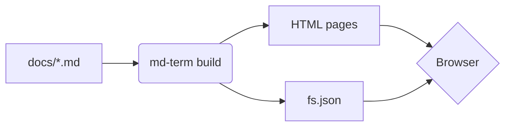
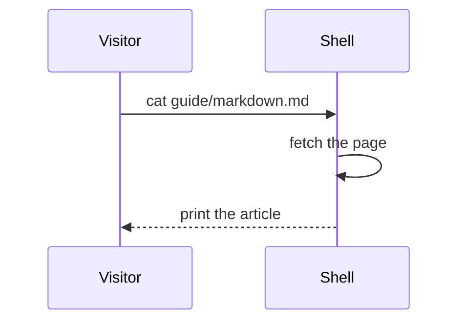

# Markdown

md-term renders [CommonMark](https://commonmark.org/) plus the extensions on
this page. Each section shows the source and, right below it, the result.

## Text

```markdown
**Bold**, *italic*, ~~strikethrough~~, `inline code` and a [link](writing.md).
```

**Bold**, *italic*, ~~strikethrough~~, `inline code` and a [link](writing.md).

## Lists

```markdown
- an item
  - a nested item
- [x] a finished task
- [ ] an open task

1. first
2. second
```

- an item
  - a nested item
- [x] a finished task
- [ ] an open task

1. first
2. second

## Tables

```markdown
| Command | Purpose        |
| ------- | -------------- |
| `ls`    | list a folder  |
| `cat`   | read a page    |
```

| Command | Purpose        |
| ------- | -------------- |
| `ls`    | list a folder  |
| `cat`   | read a page    |

## Code

A fenced block with a language name is highlighted during the build. In the
browser every block gets a `[copy]` link, and Python blocks get `[run]` when
[Python is enabled](python.md).

````markdown
```python
def greet(name: str) -> str:
    return f"hello, {name}"

print(greet("world"))
```
````

```python
def greet(name: str) -> str:
    return f"hello, {name}"


print(greet("world"))
```

## Alerts

GitHub's alert syntax is supported, with five types: `NOTE`, `TIP`,
`IMPORTANT`, `WARNING` and `CAUTION`. Obsidian's callouts, with more types,
custom titles and folding, are described under
[Obsidian vaults](obsidian.md#callouts).

```markdown
> [!TIP]
> Alerts written this way also render on GitHub.
```

> [!NOTE]
> Useful information the reader should not miss.

> [!TIP]
> Alerts written this way also render on GitHub.

> [!IMPORTANT]
> Something the reader needs in order to succeed.

> [!WARNING]
> Something that needs attention right away.

> [!CAUTION]
> The risks or bad outcomes of an action.

The mkdocs-style syntax works too, and it accepts a custom title:

```markdown
!!! warning "Check your backups"
    The body is indented by four spaces.
```

!!! warning "Check your backups"
    The body is indented by four spaces.

## Formulas

Formulas are written in LaTeX between dollar signs. They are converted to
MathML during the build, so they need no JavaScript.

```markdown
Euler's identity is $e^{i\pi} + 1 = 0$.

$$
\int_0^\infty e^{-x^2}\,dx = \frac{\sqrt{\pi}}{2}
$$
```

Euler's identity is $e^{i\pi} + 1 = 0$.

$$
\int_0^\infty e^{-x^2}\,dx = \frac{\sqrt{\pi}}{2}
$$

Matrices and sums work as well:

$$
\begin{pmatrix} a & b \\ c & d \end{pmatrix}
\qquad
\sum_{k=1}^{n} k = \frac{n(n+1)}{2}
$$

A dollar sign next to a digit or a space is left alone, so a price such as
$5 or $10 needs no escaping. A formula the converter cannot read is shown as
its source and reported as a build warning.

## Diagrams

A `mermaid` block is drawn as a diagram, in the colors of the current theme.

````markdown

````




> [!NOTE]
> Diagrams are the one feature that needs JavaScript and the network: the
> Mermaid library is loaded from `cdn.jsdelivr.net`, and only on pages that
> have a diagram. Without it, the block is shown as its source.

## Definition lists

```markdown
Front matter
: The YAML header at the top of a page.

Post
: A page with a `date`.
```

Front matter
: The YAML header at the top of a page.

Post
: A page with a `date`.

## Footnotes

```markdown
A claim that needs a source[^source].

[^source]: The source goes here.
```

A claim that needs a source[^source].

[^source]: The source goes here.

## Quotes and rules

```markdown
> A plain quotation.

---
```

> A plain quotation.

---

## Raw HTML

HTML written in the markdown is kept as it is. This is how you get
<kbd>Ctrl</kbd>+<kbd>C</kbd>, a collapsible section or anything else
markdown has no syntax for.

```html
<details>
<summary>Click to expand</summary>

Hidden content, **with markdown inside**.

</details>
```

<details>
<summary>Click to expand</summary>

Hidden content, **with markdown inside**.

</details>
