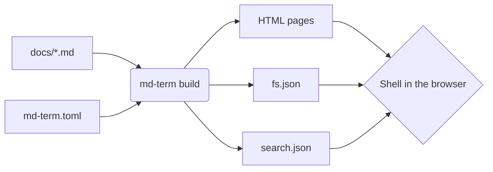

# How it works

md-term has two halves: a generator written in Python, which runs at build
time, and a shell written in JavaScript, which runs in the visitor's browser.



## What the build writes

```text
site/
├── index.html                 one page per markdown file
├── guide/
│   ├── index.html             listing generated for folders with no index.md
│   └── installation/index.html
├── tags/                      tag index and one page per tag
├── assets/
│   ├── term.css               theme
│   ├── js/                    the browser shell
│   └── python/                Python interpreter, when enabled
├── fs.json                    file tree for the shell
├── search.json                text of every page, for grep
└── feed.xml                   RSS, when there are posts and a site_url
```

## From files to URLs

| File in `docs/`           | In the shell                | Published URL           |
| ------------------------- | --------------------------- | ----------------------- |
| `index.md`                | `~/index.md`                | `/`                     |
| `guide/installation.md`   | `~/guide/installation.md`   | `/guide/installation/`  |
| `guide/index.md`          | `~/guide/index.md`          | `/guide/`               |
| `blog/photo.png`          | not listed                  | `/blog/photo.png`       |

Files and folders starting with a dot are ignored. A folder with no
`index.md` gets a listing page, the equivalent of an `ls`.

## Complete pages

Each HTML page already carries its content inside the terminal frame, as if
the `cat` command had just run. That is why:

- the site works with JavaScript turned off, browsed through links and
  directory listings
- search engines index the text normally
- any address can be opened directly or shared

## The shell

When the JavaScript loads, it reads `fs.json` and enables the prompt. From
then on:

- `ls`, `cd`, `tree`, `posts` and `tags` are answered at once, from `fs.json`
- `cat` fetches the HTML of the target page, extracts the article and prints
  it below the command; the browser address changes with it, and the back
  button works
- `grep` downloads `search.json` on the first search and looks through the
  original markdown line by line
- links inside articles become a `cat`, with no page reload
- `python` downloads the interpreter the first time and runs it in a Web
  Worker; see [Python in the browser](../guide/python.md)

The command history is kept for the browser session, and the theme chosen
with `theme` is saved between visits. Nothing is sent to any server: the
site is static files only.

## Markdown

Conversion uses markdown-it-py in CommonMark mode with the extensions shown
on the [Markdown](../guide/markdown.md) page. Two things happen during the
build so the browser has less to do:

- syntax highlighting, by Pygments
- formulas, converted from LaTeX to MathML

Mermaid diagrams are the exception: they are drawn in the browser by a
library loaded on demand.

## fs.json

```json
{
  "nodes": {
    "/": { "type": "dir", "url": "", "children": ["blog", "index.md"] },
    "/blog/hello.md": {
      "type": "file",
      "url": "blog/hello/",
      "title": "Hello",
      "date": "2026-10-05",
      "tags": ["news"]
    }
  },
  "tags": { "news": { "url": "tags/news/", "count": 1 } }
}
```

URLs are relative to the root of the site.
